# Final Project Diagrams

These diagrams are based on the current Spring Boot backend in `Schoool-Management-Backend` and the paired Angular frontend in `../Schoool-Management-Frontend`.

The project is a role-based school management system for administrators, teachers, and parents. It uses Angular, Angular Material, Spring Boot, Spring Security with JWT, Spring Data JPA, MySQL, local document storage, OpenAPI/Swagger, MapStruct, and PDFBox for report-card generation. No payment or fee module is included.

## 1. Overall Architecture Diagram

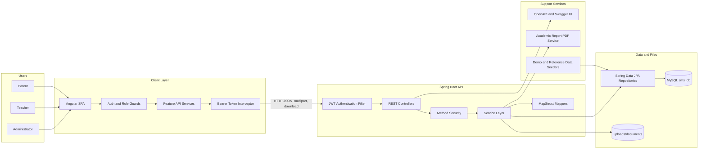

## 2. Backend Package Diagram

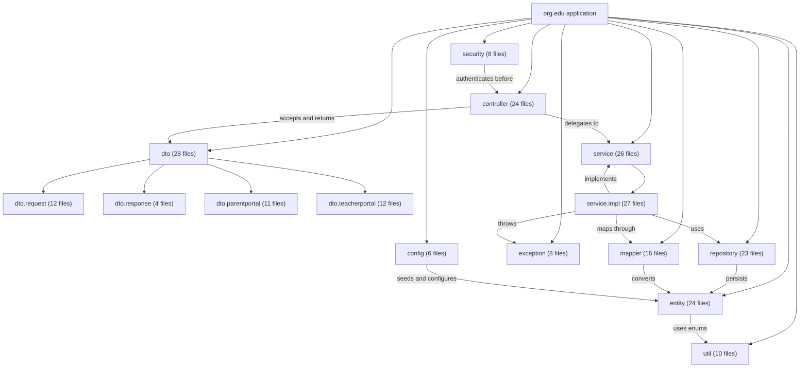

## 3. Component Diagram

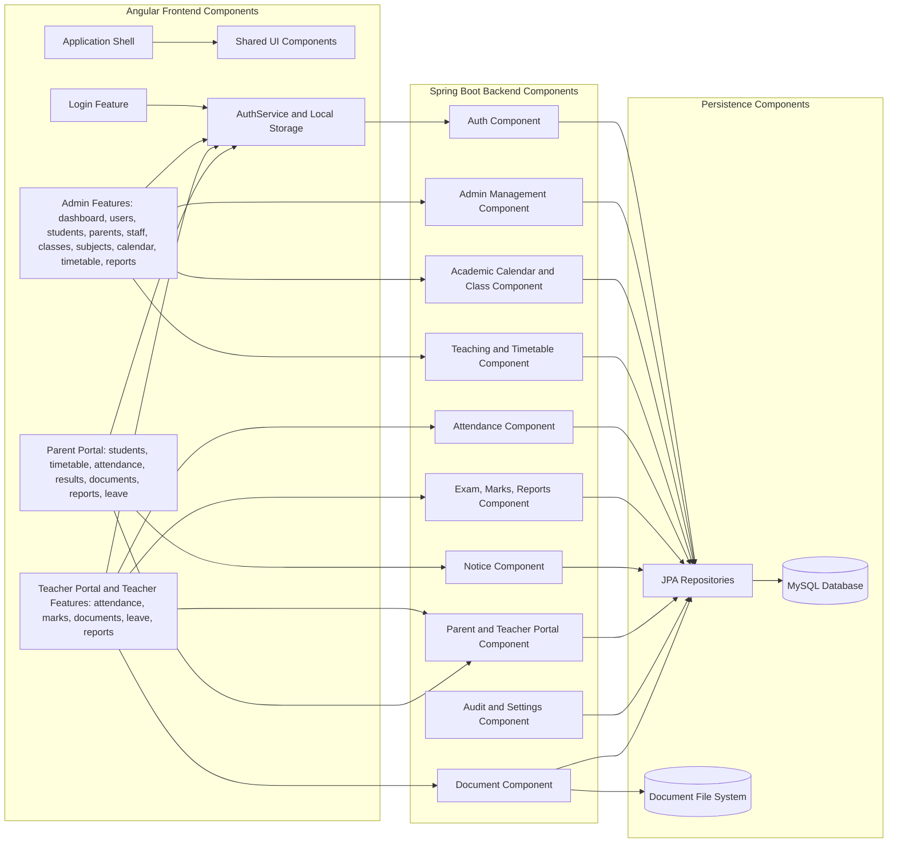

## 4. Deployment Diagram

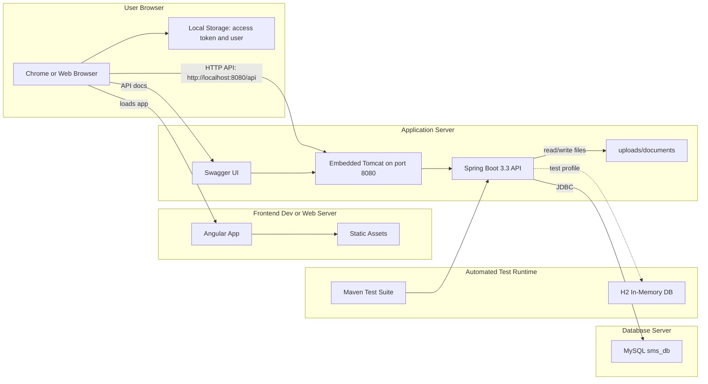

## 5. Class Diagram

```mermaid
classDiagram
    class User {
        Long id
        String name
        String email
        String password
        Role role
        boolean active
    }

    class Student {
        Long id
        String name
        LocalDate dateOfBirth
        boolean active
        String phoneNumber
    }

    class Parent {
        Long id
        String name
        String phoneNumber
        String address
        String occupation
        boolean active
    }

    class Staff {
        Long id
        String staffId
        String name
        boolean active
        String phoneNumber
        String designation
    }

    class ParentStudent {
        Long id
        String relationshipType
        boolean primaryContact
        boolean emergencyContact
    }

    class Grade {
        Long id
        String name
        Integer level
        boolean active
    }

    class SchoolClass {
        Long id
        String name
        String section
        boolean active
    }

    class Subject {
        Long id
        String code
        String name
        String description
    }

    class AcademicYear {
        Long id
        String name
        LocalDate startDate
        LocalDate endDate
        boolean current
        boolean active
    }

    class AcademicTerm {
        Long id
        String name
        LocalDate startDate
        LocalDate endDate
        boolean current
        boolean active
    }

    class StudentEnrollment {
        Long id
        LocalDate startDate
        LocalDate endDate
        EnrollmentStatus status
    }

    class TeachingAssignment {
        Long id
        boolean active
    }

    class Timetable {
        Long id
        DayOfWeek dayOfWeek
        LocalTime startTime
        LocalTime endTime
        String roomNumber
    }

    class Attendance {
        Long id
        LocalDate attendanceDate
        AttendanceStatus status
        String remarks
    }

    class LeaveRequest {
        Long id
        LocalDate startDate
        LocalDate endDate
        LeaveRequestStatus status
        boolean attendanceApplied
    }

    class Exam {
        Long id
        String name
        ExamType type
        LocalDate examDate
        BigDecimal maxMarks
        BigDecimal passMarks
    }

    class StudentMark {
        Long id
        BigDecimal marksObtained
        BigDecimal percentage
        String grade
        boolean passed
    }

    class AcademicReport {
        Long id
        AcademicReportStatus status
        BigDecimal overallPercentage
        String overallGrade
        BigDecimal attendancePercentage
    }

    class AcademicReportSubject {
        Long id
        Long subjectId
        String subjectCode
        String subjectName
        BigDecimal percentage
        String grade
        boolean passed
    }

    class Document {
        Long id
        DocumentType documentType
        String title
        String storedFileName
        boolean visibleToParent
        boolean active
    }

    class Notice {
        Long id
        String title
        NoticeAudience audience
        boolean published
        boolean active
    }

    User "1" --> "0..1" Student : profile
    User "1" --> "0..1" Parent : profile
    User "1" --> "0..1" Staff : profile
    Grade "1" --> "0..*" SchoolClass : groups
    Staff "1" --> "0..*" SchoolClass : classTeacher
    SchoolClass "1" --> "0..*" Student : currentClass
    Parent "1" --> "0..*" ParentStudent : links
    Student "1" --> "0..*" ParentStudent : links
    SchoolClass "0..*" --> "0..*" Subject : subjects
    Subject "0..*" --> "0..*" Grade : gradeSubjects
    AcademicYear "1" --> "0..*" AcademicTerm : terms
    Student "1" --> "0..*" StudentEnrollment : enrollments
    AcademicYear "1" --> "0..*" StudentEnrollment : academicYear
    SchoolClass "1" --> "0..*" StudentEnrollment : enrolledClass
    Staff "1" --> "0..*" TeachingAssignment : teaches
    SchoolClass "1" --> "0..*" TeachingAssignment : assignedClass
    Subject "1" --> "0..*" TeachingAssignment : subject
    AcademicYear "1" --> "0..*" TeachingAssignment : academicYear
    SchoolClass "1" --> "0..*" Timetable : schedule
    Subject "1" --> "0..*" Timetable : scheduledSubject
    Staff "1" --> "0..*" Timetable : scheduledTeacher
    Student "1" --> "0..*" Attendance : attendance
    SchoolClass "1" --> "0..*" Attendance : attendanceClass
    Subject "0..1" --> "0..*" Attendance : attendanceSubject
    Timetable "0..1" --> "0..*" Attendance : period
    Staff "0..1" --> "0..*" Attendance : markedBy
    Parent "1" --> "0..*" LeaveRequest : creates
    Student "1" --> "0..*" LeaveRequest : requestedFor
    Staff "0..1" --> "0..*" LeaveRequest : reviewedBy
    AcademicYear "1" --> "0..*" Exam : exams
    AcademicTerm "1" --> "0..*" Exam : termExams
    SchoolClass "1" --> "0..*" Exam : classExams
    Subject "1" --> "0..*" Exam : subjectExams
    Exam "1" --> "0..*" StudentMark : marks
    Student "1" --> "0..*" StudentMark : results
    Staff "0..1" --> "0..*" StudentMark : enteredBy
    Student "1" --> "0..*" AcademicReport : reports
    AcademicTerm "1" --> "0..*" AcademicReport : termReports
    AcademicReport "1" --> "1..*" AcademicReportSubject : subjectSnapshots
    Student "1" --> "0..*" Document : documents
    User "1" --> "0..*" Document : uploadedBy
    SchoolClass "0..1" --> "0..*" Notice : targetClass
```

## 6. ER Diagram

```mermaid
erDiagram
    USERS ||--o| STUDENTS : has_student_profile
    USERS ||--o| PARENTS : has_parent_profile
    USERS ||--o| STAFF : has_staff_profile
    USERS ||--o{ DOCUMENTS : uploads
    USERS ||--o{ AUDIT_LOGS : acts
    USERS ||--o{ ACADEMIC_REPORTS : generates
    GRADES ||--o{ SCHOOL_CLASSES : contains
    STAFF ||--o{ SCHOOL_CLASSES : owns
    SCHOOL_CLASSES ||--o{ STUDENTS : has
    SCHOOL_CLASSES }o--o{ SUBJECTS : offers
    SUBJECTS }o--o{ GRADES : assigned_to

    PARENTS ||--o{ PARENT_STUDENTS : links
    STUDENTS ||--o{ PARENT_STUDENTS : linked_to

    ACADEMIC_YEARS ||--o{ ACADEMIC_TERMS : contains
    ACADEMIC_YEARS ||--o{ STUDENT_ENROLLMENTS : tracks
    STUDENTS ||--o{ STUDENT_ENROLLMENTS : has
    SCHOOL_CLASSES ||--o{ STUDENT_ENROLLMENTS : enrolled_in

    STAFF ||--o{ TEACHING_ASSIGNMENTS : teaches
    SCHOOL_CLASSES ||--o{ TEACHING_ASSIGNMENTS : assigned
    SUBJECTS ||--o{ TEACHING_ASSIGNMENTS : assigned
    ACADEMIC_YEARS ||--o{ TEACHING_ASSIGNMENTS : scoped

    SCHOOL_CLASSES ||--o{ TIMETABLES : schedules
    SUBJECTS ||--o{ TIMETABLES : schedules
    STAFF ||--o{ TIMETABLES : teaches

    STUDENTS ||--o{ ATTENDANCE : records
    SCHOOL_CLASSES ||--o{ ATTENDANCE : records
    SUBJECTS ||--o{ ATTENDANCE : optional_subject
    TIMETABLES ||--o{ ATTENDANCE : optional_period
    STAFF ||--o{ ATTENDANCE : marks

    PARENTS ||--o{ LEAVE_REQUESTS : creates
    STUDENTS ||--o{ LEAVE_REQUESTS : requests
    STAFF ||--o{ LEAVE_REQUESTS : reviews

    ACADEMIC_YEARS ||--o{ EXAMS : has
    ACADEMIC_TERMS ||--o{ EXAMS : has
    SCHOOL_CLASSES ||--o{ EXAMS : assigned
    SUBJECTS ||--o{ EXAMS : tested
    EXAMS ||--o{ STUDENT_MARKS : has
    STUDENTS ||--o{ STUDENT_MARKS : earns
    STAFF ||--o{ STUDENT_MARKS : enters

    STUDENTS ||--o{ ACADEMIC_REPORTS : receives
    ACADEMIC_TERMS ||--o{ ACADEMIC_REPORTS : covers
    SCHOOL_CLASSES ||--o{ ACADEMIC_REPORTS : class_snapshot
    ACADEMIC_REPORTS ||--|{ ACADEMIC_REPORT_SUBJECTS : contains

    STUDENTS ||--o{ DOCUMENTS : owns
    SCHOOL_CLASSES ||--o{ NOTICES : target

    USERS {
        long id PK
        string name
        string email UK
        string password
        string role
        bool active
    }
    STUDENTS {
        long id PK
        long user_id FK
        long class_id FK
        string name
        date date_of_birth
        bool active
    }
    PARENTS {
        long id PK
        long user_id FK
        string name
        string phone_number
        bool active
    }
    STAFF {
        long id PK
        long user_id FK
        string staff_id UK
        string name
        string designation
        bool active
    }
    PARENT_STUDENTS {
        long id PK
        long parent_id FK
        long student_id FK
        string relationship_type
        bool primary_contact
        bool emergency_contact
    }
    GRADES {
        long id PK
        string name UK
        int level UK
        bool active
    }
    SCHOOL_CLASSES {
        long id PK
        long grade_id FK
        long class_teacher_id FK
        string name
        string section
        bool active
    }
    SUBJECTS {
        long id PK
        string code
        string name
        string description
    }
    ACADEMIC_YEARS {
        long id PK
        string name UK
        date start_date
        date end_date
        bool current
        bool active
    }
    ACADEMIC_TERMS {
        long id PK
        long academic_year_id FK
        string name
        date start_date
        date end_date
        bool current
        bool active
    }
    STUDENT_ENROLLMENTS {
        long id PK
        long student_id FK
        long academic_year_id FK
        long class_id FK
        string status
    }
    TEACHING_ASSIGNMENTS {
        long id PK
        long staff_id FK
        long class_id FK
        long subject_id FK
        long academic_year_id FK
        bool active
    }
    TIMETABLES {
        long id PK
        long class_id FK
        long subject_id FK
        long staff_id FK
        string day_of_week
        time start_time
        time end_time
    }
    ATTENDANCE {
        long id PK
        long student_id FK
        long class_id FK
        long subject_id FK
        long timetable_id FK
        long marked_by_staff_id FK
        date attendance_date
        string status
    }
    LEAVE_REQUESTS {
        long id PK
        long parent_id FK
        long student_id FK
        long reviewed_by_staff_id FK
        date start_date
        date end_date
        string status
    }
    EXAMS {
        long id PK
        long academic_year_id FK
        long academic_term_id FK
        long class_id FK
        long subject_id FK
        string name
        string type
    }
    STUDENT_MARKS {
        long id PK
        long exam_id FK
        long student_id FK
        long entered_by_staff_id FK
        decimal marks_obtained
        decimal percentage
        string grade
    }
    ACADEMIC_REPORTS {
        long id PK
        long student_id FK
        long academic_term_id FK
        long class_id FK
        string status
        decimal overall_percentage
    }
    ACADEMIC_REPORT_SUBJECTS {
        long id PK
        long academic_report_id FK
        long subject_id
        string subject_code
        string subject_name
        decimal percentage
    }
    DOCUMENTS {
        long id PK
        long student_id FK
        long uploaded_by_user_id FK
        string document_type
        string stored_file_name
        bool visible_to_parent
        bool active
    }
    NOTICES {
        long id PK
        long class_id FK
        string title
        string audience
        bool published
        bool active
    }
    AUDIT_LOGS {
        long id PK
        long actor_user_id FK
        string action
        string entity_type
        long entity_id
    }
    BLACKLISTED_TOKENS {
        long id PK
        string token UK
        datetime expires_at
    }
```

## 7. Sequence Diagrams

### 7.1 Login and JWT Session

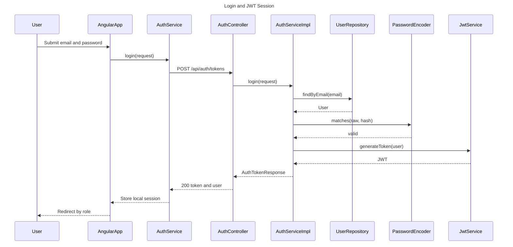

### 7.2 Teacher Bulk Attendance Marking

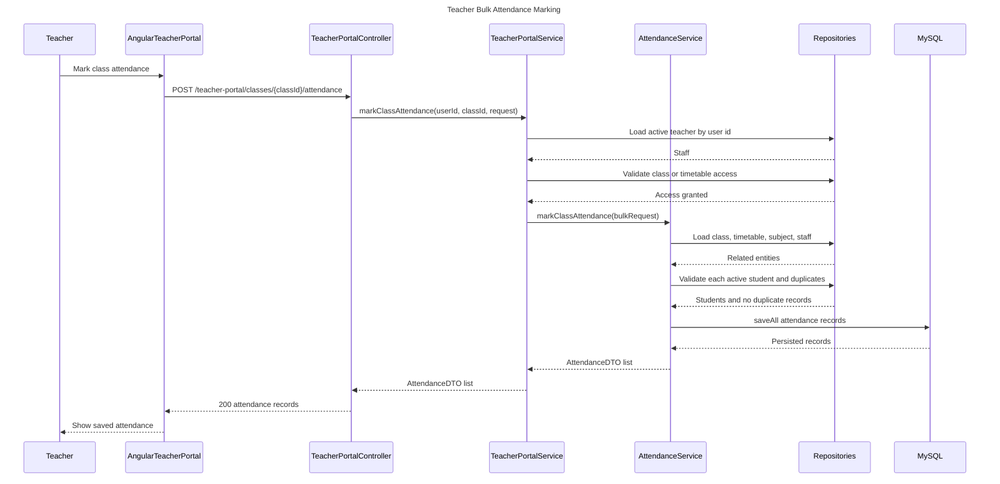

### 7.3 Parent Leave Request and Teacher Review

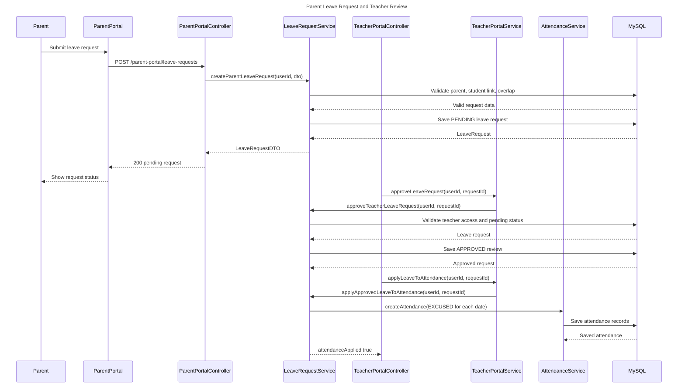

### 7.4 Academic Report Generation and PDF Download

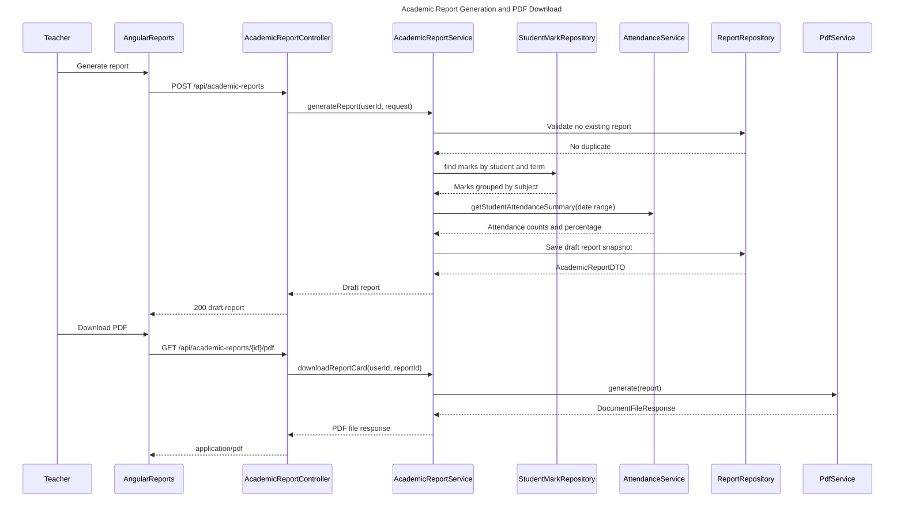

### 7.5 Document Upload and Parent Download

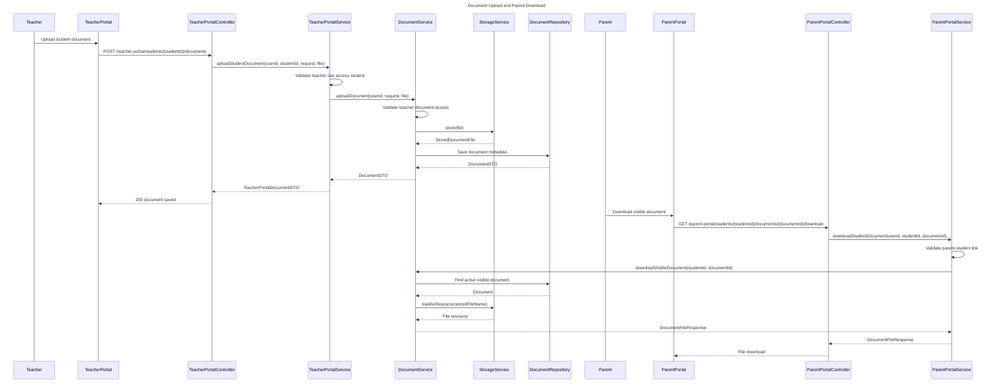

## 8. Activity Diagrams

### 8.1 Login and Role-Based Navigation

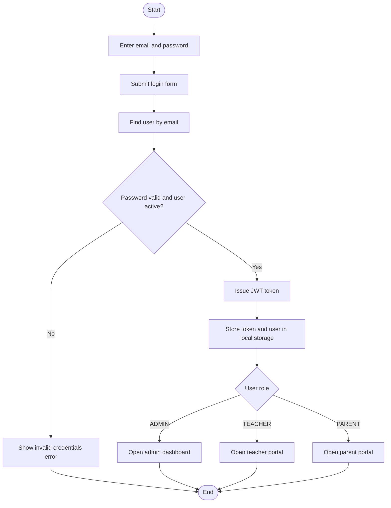

### 8.2 Bulk Attendance Marking

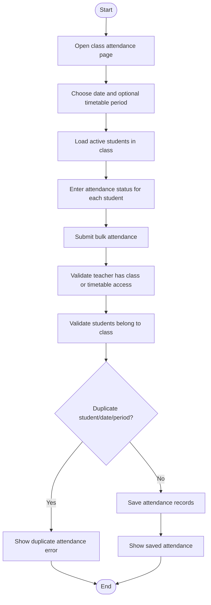

### 8.3 Leave Request Review and Attendance Application

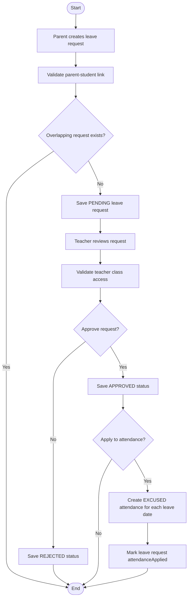

### 8.4 Academic Report Generation and Publishing

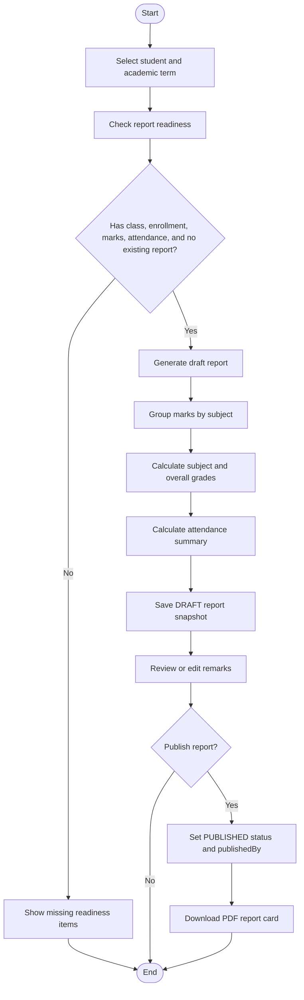

### 8.5 Parent Portal Student Data Access

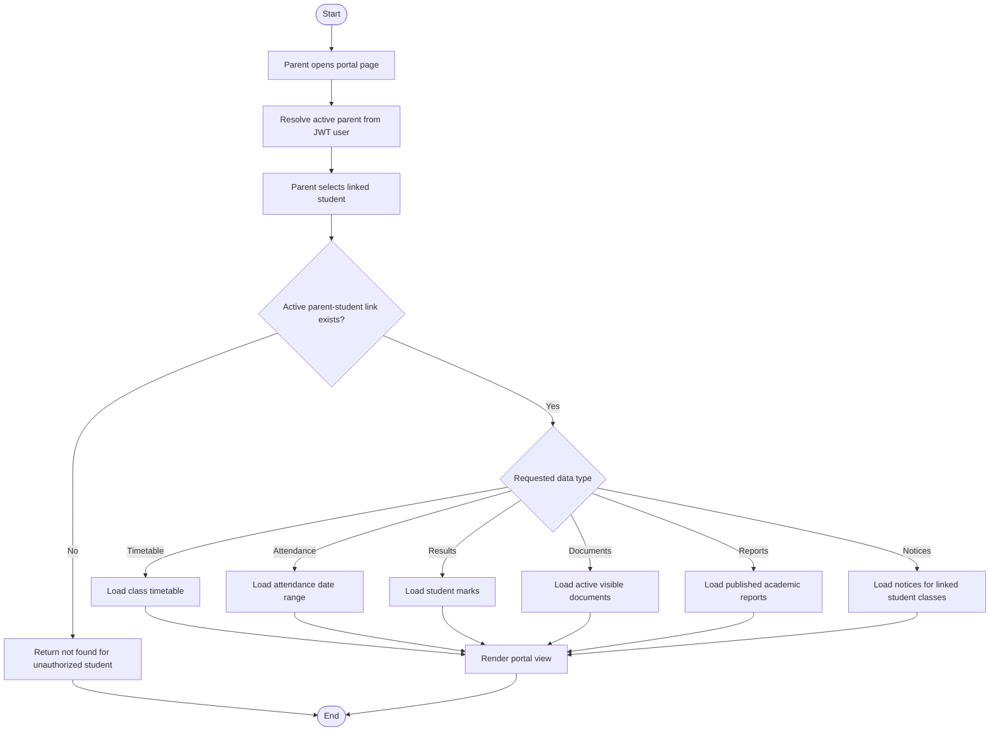

## 9. Use Case Diagram

Mermaid does not provide a dedicated UML use-case diagram type, so this diagram uses a flowchart layout with actors on the left and system use cases grouped inside the School Management System boundary.

```mermaid
flowchart LR
    subgraph actors ["Actors"]
        guest["Guest User"]
        admin["Administrator"]
        teacher["Teacher"]
        parent["Parent"]
    end

    subgraph system ["School Management System"]
        login(["Login"])
        logout(["Logout"])
        viewDashboard(["View Dashboard"])

        manageUsers(["Manage Users"])
        manageStudents(["Manage Students"])
        manageParents(["Manage Parents"])
        manageStaff(["Manage Staff"])
        manageGrades(["Manage Grades"])
        manageClasses(["Manage Classes"])
        manageSubjects(["Manage Subjects"])
        manageAcademicCalendar(["Manage Academic Years and Terms"])
        manageTeachingAssignments(["Manage Teaching Assignments"])
        manageTimetable(["Manage Timetable"])
        manageSettings(["Manage System Settings"])
        viewAuditLogs(["View Audit Logs"])

        viewTeacherDashboard(["View Teacher Dashboard"])
        viewAssignedClasses(["View Assigned Classes and Schedule"])
        markAttendance(["Mark Class Attendance"])
        viewAttendance(["View Attendance"])
        manageExams(["Manage Exams"])
        enterMarks(["Enter Student Marks"])
        manageDocuments(["Upload and Manage Student Documents"])
        reviewLeave(["Review Leave Requests"])
        generateReports(["Generate Academic Reports"])
        publishReports(["Publish Academic Reports"])

        viewParentDashboard(["View Parent Dashboard"])
        viewLinkedStudents(["View Linked Students"])
        viewStudentTimetable(["View Student Timetable"])
        viewStudentAttendance(["View Student Attendance"])
        viewResults(["View Results"])
        viewVisibleDocuments(["View Visible Documents"])
        viewPublishedReports(["View Published Reports"])
        viewNotices(["View Notices"])
        createLeave(["Create Leave Request"])
        cancelLeave(["Cancel Leave Request"])

        downloadFiles(["Download Documents and Report Cards"])
    end

    guest --> login

    admin --> login
    admin --> logout
    admin --> viewDashboard
    admin --> manageUsers
    admin --> manageStudents
    admin --> manageParents
    admin --> manageStaff
    admin --> manageGrades
    admin --> manageClasses
    admin --> manageSubjects
    admin --> manageAcademicCalendar
    admin --> manageTeachingAssignments
    admin --> manageTimetable
    admin --> manageSettings
    admin --> viewAuditLogs
    admin --> manageExams
    admin --> enterMarks
    admin --> manageDocuments
    admin --> generateReports
    admin --> publishReports
    admin --> downloadFiles

    teacher --> login
    teacher --> logout
    teacher --> viewTeacherDashboard
    teacher --> viewAssignedClasses
    teacher --> markAttendance
    teacher --> viewAttendance
    teacher --> manageExams
    teacher --> enterMarks
    teacher --> manageDocuments
    teacher --> reviewLeave
    teacher --> generateReports
    teacher --> publishReports
    teacher --> downloadFiles

    parent --> login
    parent --> logout
    parent --> viewParentDashboard
    parent --> viewLinkedStudents
    parent --> viewStudentTimetable
    parent --> viewStudentAttendance
    parent --> viewResults
    parent --> viewVisibleDocuments
    parent --> viewPublishedReports
    parent --> viewNotices
    parent --> createLeave
    parent --> cancelLeave
    parent --> downloadFiles

    login -.-> viewDashboard
    login -.-> viewTeacherDashboard
    login -.-> viewParentDashboard
```
